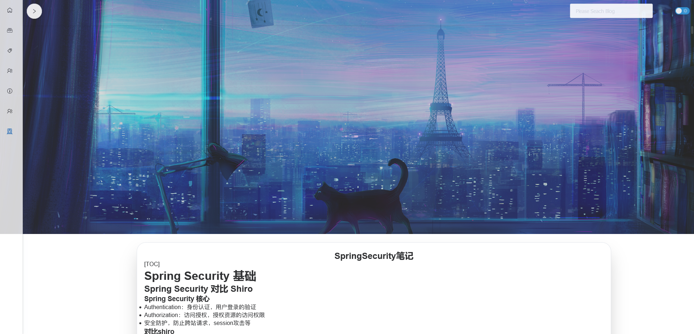
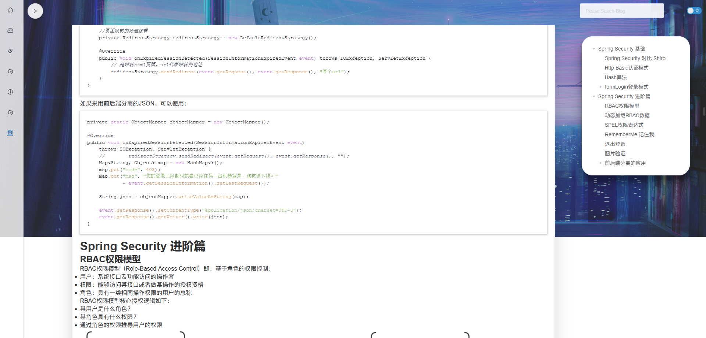

# Simplest-Frontend


## 项目背景&设计理由

​    **第一版背景**：项目的第一版名字叫做ZhiyuBlog，为什么会叫Zhiyu，这和大学期间大家都这样叫我名字所以叫着叫着就习惯了，所以我把名字用拼音改写成了网名，最后在自己的实践项目上使用了其名字，所以叫做ZhiyuBlog。可惜的是，这个项目从开源到现在没有一个star，主要是技术迭代太快，当我写这个项目用的模版渲染引擎thymeleaf，而写完后的那年前后端分离正大火大热。

*第一版历史分支地址*：[zhiyu1998/Simplest-Blog-Backend at ZhiyuBlog (github.com)](https://github.com/zhiyu1998/Simplest-Blog-Backend/tree/ZhiyuBlog)

​    **第二版背景**： 当时第一版写的时候正是临近大三，年少无知，取名字太过于主观，可能也是没有人star的原因之一吧。所以更名为：Simplest （大道至简），为什么要取这个名字？主要原因还是个人比较喜欢安静且简单，所以取下了这个名字。这个项目是在笔者科研的业余时间写出来的，借鉴了Material Design 风格的 Hexo 主题。

> 注：此项目从第一版2019年开始着手，期间从前后端开发再到部署都是一个人，个人比较菜，但项目很适合学习，在2019-2021.11中间的空隙一直没动过此项目；第二个版本是我在读研期间（2021年11月中旬）开始重构项目，也没想着部署到云（因为没人看，哈哈哈），再加上今年前端vue大更新（vue3，pinia加入vue大家庭，vueRoute4，Vite2）很多技术都需要学习，期间做此项目学习了很多，做了很多次失败的测试和实验，但没关系，我开源此项目的初衷就是力所能及的帮到你的需求！

后端地址：[Simplest-Blog-Backend](https://github.com/zhiyu1998/Simplest-Blog-Backend)

​	**LOGO设计理由（从上至下，从左至右）**：首先头上的毛为S代表本次项目的名称（Simplest）的首字母；整个吉祥物是以猫为主，主要是2021年很多人都比较喜欢猫，所以以猫为吉祥物，为什么以白猫作为吉祥物而不是黑猫、大橘、银渐层..是因为笔者比较喜欢这个配色的猫；再说卫衣的设计是因为这个项目的重构是在冬天，我经常冬天穿着卫衣在实验室写代码，所以给吉祥物也套上了我经常穿的灰色卫衣，再加上本次项目大致架构是用Vue和Spring Boot构成，所以卫衣的左侧标上了两个框架的图标；再者右手的点赞手势是因为笔者拍照的时候喜欢用这个姿势，所以这就是整个logo的设计流程。

## 文件架构

后端的设计完全取决于前端，我在写前端需要什么数据我就去后端设计什么接口，目前接口还是比较少，代码也比较简单，后续会根据业务加上。

````
```
├── Simplest/src
       ├── assets           样式资源存放处
       		├── css			样式
            └── font		字体
       ├── components		公共的组件（头部、侧栏导航）
       		├── common		公共组件
            └── typed		封装打字机typed.js
       └── router       	路由相关
       ├── store            全局状态管理
       ├── types        	类型定义（interface）
       ├── utils            工具类(EventBus、markdown、请求封装、URI)
       └── views        	用户可以看到的视图
            ├── About       关于
            ├── Archive     归档
            ├── Article     文章详情
            ├── Friends     友情链接
            ├── Home        主页
            ├── Message     留言板
            └── Tag			标签
```
````


## 界面展示

### 暗黑模式适配


### 主页


### 归档


### 标签


### 留言板


### 关于


### 友情链接


### 博客详情






## 功能

### Finished & TODO

- [x] 导航
- [x] 首页
- [x] 归档  
- [x] 文章列表
- [x] 标签
- [x] 留言板
- [x] 关于
- [x] 友情链接 
- [x] 开往
- [x] 点赞与评论
- [x] 文章详情
- [x] 留言板懒加载、回复模态框
- [x] 组件动画
- [ ] 目录树算法优化（目前算法导致锚点定位有问题）
- [x] 暗黑模式适配
- [ ] 移动端适配
- [ ] 搜索文章
- [ ] 公告栏


### Feature TODO

- [ ] 考虑加入用户登录（仅是维护者的用户登录）
- [ ] 考虑加入后台管理


## 前端技术栈

| 框架         | 版本    |
| ------------ | ------- |
| axios        | 0.24.0  |
| element-plus | 2.2.0   |
| moment       | 2.29.1  |
| vue          | 3.2.25  |
| vue-router   | 4       |
| pinia        | 2.0.9   |
| highlight.js | 11.3.1  |
| marked       | 4.0.8   |
| lodash       | 4.17.21 |
| typed.js     | 2.0.12  |
| mitt         | 3.0.0   |
| animate.css  | 4.1.1   |

## 部署（Vite官方推荐使用PNPM）
注：如果没有安装PNPM，可以参照下面命令：
> npm install -g pnpm

安装依赖

> pnpm i
>
> or
>
> yarn install
>
> or
>
> npm install

运行

> pnpm dev
>
> or
>
> yarn run dev
>
> or
>
> npm run serve

如果你懒得看背景，需要启动后端整个项目才完整：

[Simplest-Blog-Backend](https://github.com/zhiyu1998/Simplest-Blog-Backend)


## 致谢

​	笔者一直在纠结要不要写这个致谢，看了很多开源的博客的致谢，很多感谢老婆、感谢女朋友的、感谢朋友的，笔者整个项目从头到尾都是一个人在搞也不是因为笔者生活比较自闭，但愿下一个版本（vue的下一个大版本）我能感谢我的女朋友[狗头]。那项目的结尾，我就感谢一下我自己在人生的20多年能学到这么多知识并将其运用和未来有幸能贡献此仓库的你…


